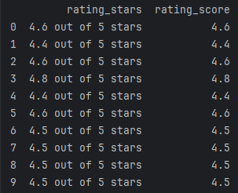
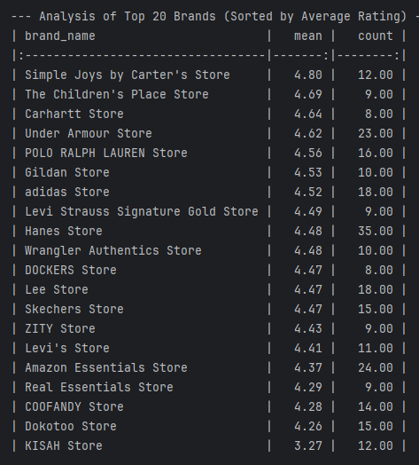
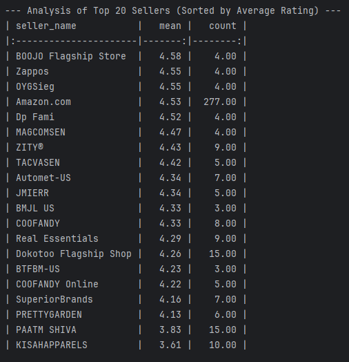
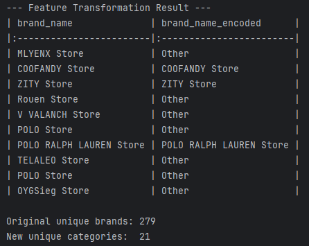
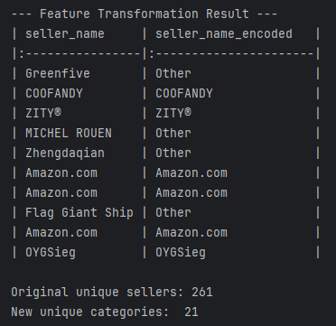
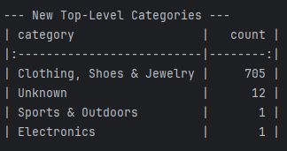
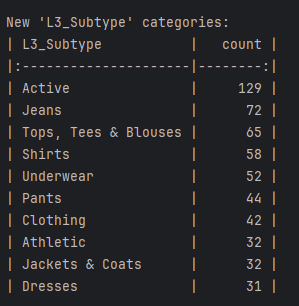
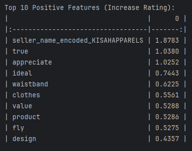
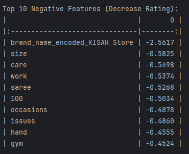

# Random-Forest-Amazon-Products

# Análisis Predictivo de Ratings de Productos en Amazon

> **Proyecto de Portfolio de Data Science:** Este repositorio documenta el proceso de extremo a extremo para predecir el rating de estrellas de productos de Amazon (específicamente en la categoría de ropa) utilizando modelos de Regresión y Random Forest.

## 1. Problema de Negocio y Objetivos

En el competitivo panorama del e-commerce, el rating de un producto es un factor decisivo para la decisión de compra del cliente y, consecuentemente, para los ingresos del vendedor. Comprender *qué* factores influyen en un rating de 5 estrellas frente a uno de 3.5 es crítico.

El **objetivo** de este proyecto es construir un modelo de regresión capaz de:
1.  **Predecir** el `rating_score` (1-5 estrellas) de un producto basándose en sus características.
2.  **Identificar** los *drivers* clave que influyen en la satisfacción del cliente, proporcionando información accionable para vendedores y marcas.

El modelo final logra una **precisión promedio de ±0.14 estrellas (MAE)**, identificando la prueba social (`rating_count_int`) y las palabras clave del texto (NLP) asi como los predictores numéricos y categóricos más importantes.

## 2. El Dataset

El proyecto utiliza un dataset (`products.csv`) que contiene 728 registros y 34 columnas. Las características clave incluyen:
* `title`, `about_item`, `customer_review_summary` (Campos de texto)
* `brand_name`, `seller_name` (Campos categóricos)
* `breadcrumbs` (Campo de jerarquía)
* `rating_count`, `price_value` (Campos numéricos)
* `rating_stars` (Campos de objetivo o variable target)

## 3. Limpieza de Datos y Feature Engineering

La fase más crítica fue transformar los datos brutos en *features* numéricas limpias y listas para el modelo.

### Variable Objetivo (`rating_score`)
La columna `rating_stars` (ej. "4.6 out of 5 stars") se limpió y transformó a una columna numérica `float` llamada `rating_score`. Las filas sin un `rating_score` (9 en total) fueron eliminadas, resultando en un dataset final de 719 productos.

### Variables Categóricas (Manejo de Alta Cardinalidad)
Las columnas `brand_name` y `seller_name` contenían cientos de valores únicos (alta cardinalidad), lo cual es un problema para el modelado.

* **Análisis:** Para ello, primero se analizaron las 20 marcas y vendedores más frecuentes.
    
    
    

* **Transformación:** Posteriormente, se implementó una estrategia de agrupación "Top-N". Las 20 categorías principales se mantuvieron y todas las demás se agruparon en una nueva categoría "Other". Esto redujo la dimensionalidad de 500+ a solo 21 categorías, balanceando información y eficiencia.

    
    

### Variables Categóricas (Manejo de Jerarquía)
La columna `breadcrumbs` (ej. `Clothing, Shoes & Jewelry › Men › Clothing...`) contenía información jerárquica valiosa.

* **Análisis:** Un análisis inicial de la categoría de nivel superior (`L0_Category`) reveló un desbalanceo extremo: 705 de 719 productos pertenecían a "Clothing, Shoes & Jewelry".

    

* **Transformación:** Para construir un modelo más especializado y preciso, se tomó la decisión estratégica de **filtrar el dataset** para incluir *solo* productos de "Clothing, Shoes & Jewelry".
* Posteriormente, se extrajeron subcategorías más granulares (hasta el nivel 3), creando la feature `L3_Subtype`, que demostró tener un poder predictivo mucho mayor.

    

### Ingeniería de Features de Texto (NLP)
Se extrajo valor de las columnas de texto de tres maneras:

1.  **Features de Longitud:** Se crearon `title_length` y `about_item_length` como *proxies* del "esfuerzo del vendedor".
2.  **Features de Estructura:** Se creó `about_item_bullets` (contando los `.`) para cuantificar la calidad del listado Supusimos que una descripción con un mayor número de "." era indicador de una descripción más elaborada y de mayor calidad.
3.  **Features de Contenido (TF-IDF):** Se creó una "super-columna" (`text_features`) combinando `title`, `about_item` y `customer_review_summary`. Esta columna se usó como entrada para un `TfidfVectorizer` dentro del pipeline.

## 4. Pipeline de Modelado en `scikit-learn`

Para asegurar la reproducibilidad, evitar el *data leakage* y automatizar el preprocesamiento, se construyó un `Pipeline` completo.

El `ColumnTransformer` gestiona todos los pasos de preprocesamiento en paralelo:
* **Pipeline Numérico:** (`price_value`, `rating_count_int`, etc.)
    1.  `SimpleImputer(strategy='median')`: Imputa valores `NaN` (ej. en `price_value`) sustituyéndolos por la mediana.
    2.  `StandardScaler()`: Escala los datos para la Regresión Lineal.
* **Pipeline Categórico:** (`brand_name_encoded`, `L3_Subtype`, etc.)
    1.  `SimpleImputer(strategy='most_frequent')`: Imputa `NaN` (ej. en `L3_Subtype`) sustituyéndolos por el valor más frecuente.
    2.  `OneHotEncoder()`: Convierte las categorías en columnas *dummy* (una columna por categoría y llena de 1 y 0s).
* **Pipeline de Texto:** (`text_features`)
    1.  `TfidfVectorizer(stop_words="english", max_features=200)`: Analiza el texto y lo convierte en una matriz de 200 *keywords* predictivas. Además, no tiene en cuenta palabras muy comunes del idioma como "and" o "the".

## 5. Evaluación y Selección del Modelo

Se entrenaron y compararon dos modelos utilizando el *pipeline* de preprocesamiento. El **Random Forest** fue el claro ganador.

| Métrica | Regresión Lineal (Baseline) | **Random Forest (Ganador)** |
| :--- | :--- | :--- |
| **$R^2$** | 0.3803 | **0.4244** |
| **MAE** | 0.1925 estrellas | **0.1489 estrellas** |
| **RMSE** | 0.2724 estrellas | **0.2625 estrellas** |

El Random Forest fue un **22.6% más preciso** (menor MAE) que la Regresión Lineal, demostrando su capacidad para capturar las relaciones no lineales entre las *features* y el rating.

## 6. Interpretación de Resultados

El análisis de los coeficientes (LR) y la importancia de las *features* (RF) revela *por qué* los productos tienen éxito.

### Modelo 1: Regresión Lineal (Baseline)
El modelo lineal identificó correctamente palabras clave positivas y negativas. Sin embargo, también demostró una **alta inestabilidad** debido a la multicolinealidad (ej. la "Anomalía KISAH"), haciéndolo poco fiable.

### Modelo 2: Random Forest (Modelo Ganador)
El "resumen" del Random Forest (`feature_importances_`) es mucho más estable y fiable. Nos proporciona los verdaderos conductores o indicadores del rendimiento del producto.

## 7. Conclusiones y Valor de Negocio

El análisis de las *features* más importantes del Random Forest genera información de negocio accionable:

1.  **La Prueba Social es el Rey (`rating_count_int` - 13.7%):** La *feature* más importante, por un amplio margen, es la cantidad de reviews. Un producto con muchas reviews es inherentemente más fiable.
    * **Acción:** Los vendedores deben tener una estrategia agresiva para conseguir las primeras 50-100 reviews de un producto nuevo.

2.  **Las Palabras Clave de Texto son Críticas (`set`, `customers`):** El análisis TF-IDF demostró que palabras clave específicas son altamente predictivas.
    * **Acción:** Los vendedores deben optimizar sus títulos y descripciones, y monitorizar obsesivamente las *customer review summaries* en busca de palabras problemáticas (como `size`, que también fue identificada).

3.  **El Vendedor Importa (`seller_name_encoded_Amazon.com`):** Ser vendido directamente por "Amazon.com" es el 4º predictor más importante, demostrando que la confianza en el vendedor es un factor clave.

4.  **La Calidad del Listing Importa:** Nuestras *features* de ingeniería (como `customer_review_summary_length`, `title_length` y `about_item_bullets`) aparecieron en el Top 20, probando que el esfuerzo y la profesionalidad del listado se correlacionan con ratings más altos. Títulos de calidad y descripciones detalladas cobran una gran importancia en el rating de un producto. 

## 8. Cómo Replicar el Proyecto

1.  Clonar este repositorio: `git clone [URL_DEL_REPOSITORIO]`
2.  Crear un entorno virtual e instalar las dependencias: `pip install -r requirements.txt` (Asegúrate de incluir `pandas`, `scikit-learn`, `numpy` y `tabulate`).
3.  Ejecutar el Jupyter Notebook (`.ipynb`) o el script de Python (`.py`) para entrenar los modelos y reproducir los resultados.

